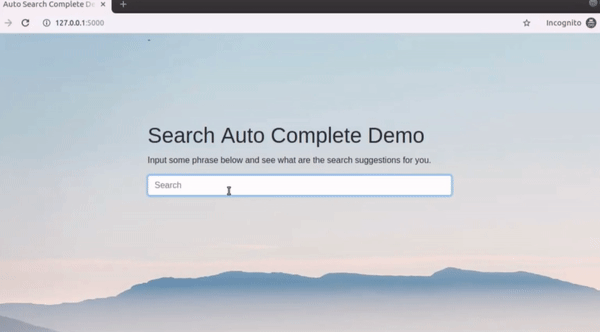
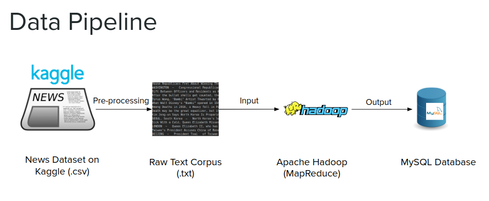
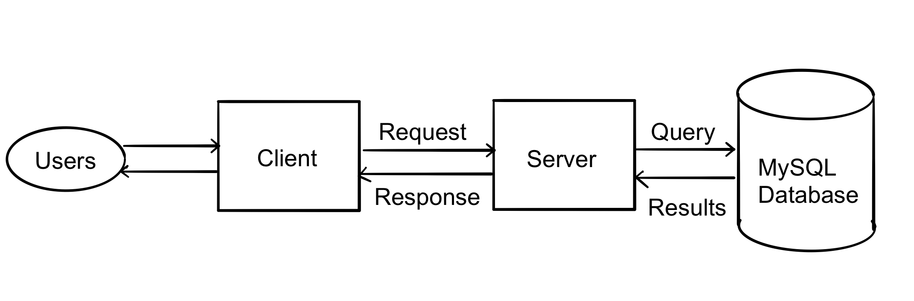
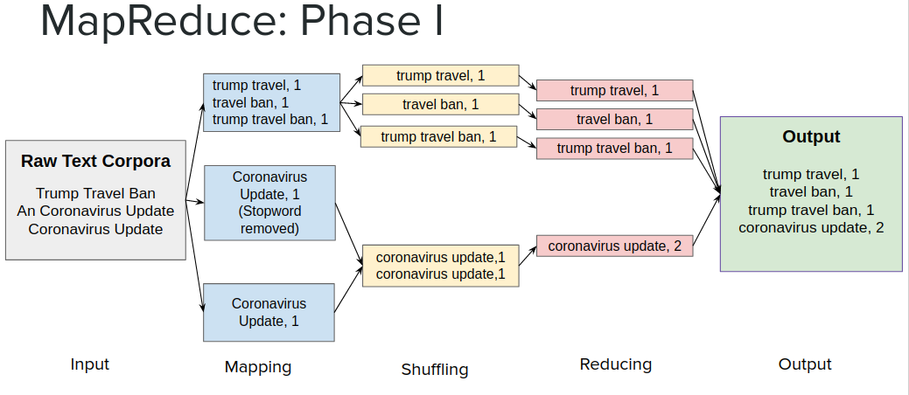
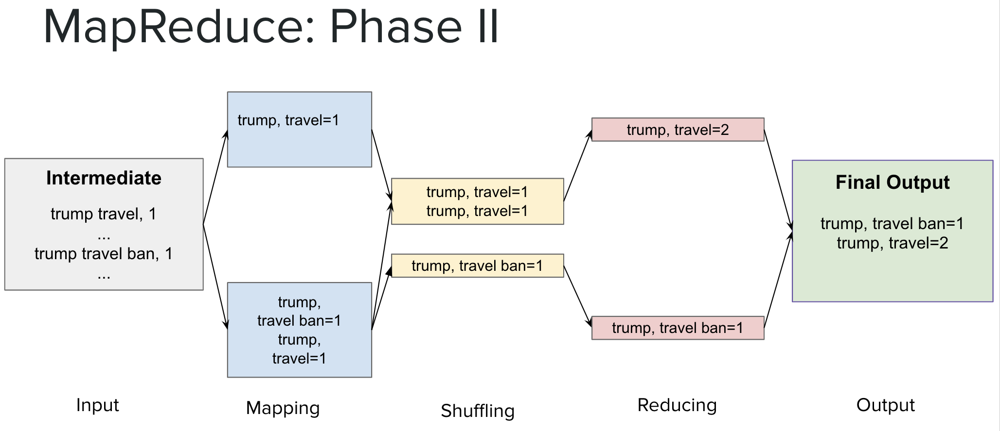

Welcome to **AutoComplete**! AutoComplete aims to provide suggestions to autocomplete user's input.



### Table of Contents
- [Design Details](#design-details)
- [Run Code and Deploy](#run-code-and-deploy)
    * [Database Configurations](#database-configurations)
    * [Demo](#demo)
    * [Hadoop Mapreduce](#hadoop-mapreduce)
- [References and Resources](#references-and-resources)

### Design Details


- This project is using [Kaggle All the news dataset](https://www.kaggle.com/snapcrack/all-the-news) as raw data. The original dataset includes columns such as `title`, `content`, `year of publication`, `url`, etc. By extracting `title` and `content` columns from the news dataset on Kaggle, the program can construct some text corpora as the input of MapReduce job.
- After processing data, the final output will be saved to the MySQL database. Based on the data saved in the database, The program will be able to provide autocomplete web services as shown in the demo.


- How to autocomplete?
Let's denote user input as `I` and the phrase following `I` as `F(i)`. By comparing the number of appearances of `IF(0)`, `IF(1)`, ..., `IF(n)`, we can find which phrase is more likely to appear following user input `I`.
For example: given recent news corpus as `president obama, president trump travel ban,
president trump immigration, president trump said `. If the user input `president`, then it is more likely they will input `trump` as the next word rather than `obama`.




### Run Code and Deploy
#### Database Configurations
Requirements:
- [MySQL](https://dev.mysql.com/downloads/installer/)

Your table should be like:
 | Field          | Type          | Null | Key | Default | Extra |
 | --          | --         |--  | --  | -- | --  |
 | starting_words | varchar(3000) | YES  |     | NULL    |       |
 | following_word | varchar(3000) | YES  |     | NULL    |       |
 | word_count     | int(11)       | YES  |     | NULL    |       |

You need to configurate database related fields in `/demo/config.py` and `model/ModelDriver.java`.


#### Demo
To run demo code, make sure you have install Python3 and the following packages:
```
flask==1.0.2
pymysql==0.9.2
flask_sqlalchemy==2.3.2
flask_bootstrap==3.3.7.1
```
Alternatively, you can run the following command to install packages:
```
$ pip install -r demo/requirements.txt
```
After all required packages has been intalled, we can run the demo code now:
```
$ python3 demo/run.py
```

#### Hadoop Mapreduce
Requirements:
- [Apache Hadoop](https://hadoop.apache.org/docs/stable/hadoop-project-dist/hadoop-common/SingleCluster.html)
- [Java](https://cwiki.apache.org/confluence/display/HADOOP2/HadoopJavaVersions)
- [MySQL Java Connector](https://dev.mysql.com/downloads/connector/j/5.1.html)

```
$ hadoop com.sun.tools.javac.Main [PATH_TO_MODEL_FOLDER]/*.java
$ jar cf model.jar *.class    
$ hadoop jar [PATH_TO_MODEL_FOLDER]/model.jar ModelDriver [PATH_TO_INPUT_FOLDER] [PATH_TO_OUTPUT_FOLDER] [N] [threshold] [topK]
```


### References and Resources
- https://mdbootstrap.com/snippets/jquery/ascensus/1138787
- https://www.kaggle.com/snapcrack/all-the-news
- https://jqueryui.com/autocomplete/
- jQuery Foundations and other contributros
- Homepage photo by Paul Earle on Unsplash
- https://github.com/blackruan/auto-complete
- https://hadoop.apache.org/docs/current/hadoop-mapreduce-client/hadoop-mapreduce-client-core/MapReduceTutorial.html
- Stopword list: https://www.geeksforgeeks.org/removing-stop-words-nltk-python/